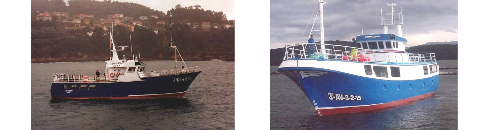
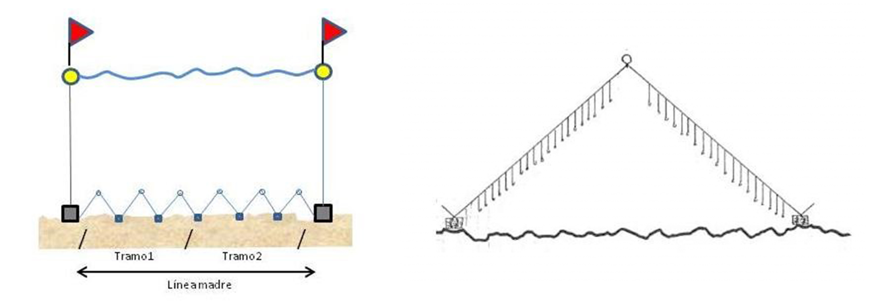

```{r setup, include=FALSE}
#knitr::opts_chunk$set(echo = FALSE) # By default, hide code; set to TRUE to see code
##knitr::opts_chunk$set(fig.pos = 'p') # Places figures on pages separate from text
#knitr::opts_chunk$set(out.width = '100%', dpi=300) # Figure resolution and size
#knitr::opts_chunk$set(fig.env="figure") # Latex figure environment
```

# Resumen 
  Se describen los resultados obtenidos en la campaña de pesca efectuada por observadores a bordo de dos barcos comerciales de palangre de fondo (Os Castros y Siempre San Pablo) dirigidos a la captura del besugo. Las salidas se efectuaron en diciembre 2021 en el Mar Cantábrico (Div. 8c ICES) realizándose un total de 23 lances en los cuales se capturaron 737 kg de besugo (571  ejemplares). El buque Siempre San Pablo obtuvo un CPUE de 17.37 individuos por cada 1000 anzuelos, mientras que el barco Os Castros capturó un promedio de 5.95 individuos por 1000 anzuelos (desv.estandar: 7.13). En cuanto al CPUE en peso, el Siempre San Pablo capturó 26.85kg por 1000 anzuelos mientras que el barco Os Castros se obtuvieron 6.16 kg. El CPUE fue más elevado frente a la costa asturiana que en la costa gallega. El rango de tallas del besugo capturado estuvo entre 26 y 58 cm, con una talla media de 40 y 46 cm para el barco Os Castros y Siempre San Pablo respectivamente.

# Introducción

El besugo es una especie de profundidad (en su etapa adulta) que tiene un alto valor comercial. Se captura fundamentalmente con palangre de fondo a lo largo del Atlántico nordeste y oeste del mar Mediterráneo. Las capturas de besugo en el Nordeste Atlántico fueron muy abundantes en la década de 1960 y de 1970. En la actualidad se captura alrededor del 1%-2% de aquellos niveles por lo que se considera que el stock está exhausto.

## Biología del besugo
El besugo *Pagellus bogaraveo* (Brünnich, 1768) es una especie ampliamente distribuida en el Atlántico Nororiental y en el Mar Mediterráneo. En latitud se distribuye desde Noruega (65º N) hasta las Islas Canarias (27º N) y en longitud desde las Islas Azores (30 º Oeste) al Mar Adriático (22º Este). Es una especie demersal y bentopelágica que vive sobre fondos de roca, arena y fango en aguas costeras y en la plataforma y talud continental hasta 400 m de profundidad en el Mar Mediterráneo y 700 m en el Atlántico (Bauchot & Hureau, 1986). Los juveniles se encuentran normalmente en fondos más someros que los adultos, lo que indica una migración ontogénica de ejemplares adultos hacia aguas más profundas (Olivier, 1928; Desbrosses, 1932; Morato et al., 2001).

El besugo crece hasta una talla de 70 cm (cerca de 80 cm según Bauchot and Hureau, 1986) y unos 4 kg. En el Golfo de Vizcaya la talla máxima registrada fue 68 y 70 cm en los años 60 (Lorance, 2011). Según los estudios de crecimiento realizados en esta especie a partir de la lectura de otolitos en el primer año de vida pueden alcanzar una talla de 12 a 15 centímetros, sin embargo, es una especie que presenta una baja tasa de crecimiento. La longevidad de esta especie se estima entre 14 y 26 años (Guegen, 1969; Sánchez, 1983; Krug, 1994; Meneces et al., 2001; Sobrino y Gil, 2001).

Se trata de una especie que presenta hermafroditismo protándrico (Buxton and Garratt, 1990).  La mayoría de los individuos se desarrollan primero como  machos y luego evolucionan a hembras el resto de su vida. Sin embargo, una fracción de la población nunca cambia de sexo. La talla estimada de madurez sexual (L~50~), es para el caso de las hembras 35.73 centímetros y de 30.15 centímetros para el caso de los machos (Sánchez, 1983; Alcázar et al., 1987). Es una especie ovípara con fecundación externa y se considera ponedora total o isócrona. La época de puesta en el Cantábrico tiene lugar durante el primer trimestre del año (Sánchez, 1982; 1983; Alcaraz et al., 1987; Castro, 1990).


## Unidades de gestión, pesquería y TACs
ICES  considera  tres componentes diferentes para esta especie: a) Subáreas 6, 7 y 8,  b) Subárea 9 y c) Subárea 10 (región de las Azores) (ICES, 1996; 1998a). Las interrelaciones del besugo entre las áreas 6, 7, 8 y el norte de la 9.a, así como los movimientos migratorios dentro de estas áreas han sido descritos por Gueguen (1974) utilizando técnicas de marcado-recaptura. Sin embargo, no hay evidencia de movimiento hacia la parte sur del área 9, donde actualmente tiene lugar la principal pesquería actual (Golfo de Cádiz). La información disponible, basada principalmente en estudios de genética y marcado, parece apoyar el actual supuesto de tres unidades de evaluación (6–8, 9 y 10).

La pesquería de besugo en el Golfo de Vizcaya colapsó a comienzos de los años 80. Desde mediados de los años 70 comenzó a haber un declive muy acusado de los desembarcos y desde entonces no parece que la población o el stock se haya recuperado (Lorance, 2011). Desde el colapso de las capturas hasta 2003 la pesquería permaneció sin medidas técnicas o regulación de cuotas para reducir la mortalidad por pesca en la población residual. Desde 2003 se establecieron unos TACs y solo se permite la captura accidental. En el periodo (1988-2019)  la mayoría de los desembarcos de besugo procedentes de las áreas 6-8 correspondieron a la flota española (70%), seguida de la francesa (18%) y Reino Unido (1%). En 2017 se establece una talla mínima de referencia a efectos de conservación para el besugo en el océano Atlántico Nororiental de 33 cm (Reglamento de ejecución (UE) 2017/787 de la comisión 8 de mayo de 2017). En este mismo reglamento por primera vez se recomienda establecer en cero el total admisible de capturas (TAC). La resolución de 10 de mayo de 2019, de la Secretaría General de Pesca define el máximo de captura diaria para el besugo en 15 kg/buque/día (BOE núm. 124, 24 mayo 2019). Además, desde el 2019 España ha establecido unas zonas cerradas a la pesca para la protección de juveniles (BOE Núm. 76, 29 de marzo de 201MAPA 2019a). Esta regulación prohíbe la pesca de arrastre y de palangre de fondo en determinadas zonas del centro y oeste del mar Cantábrico (Div. 8c) desde abril a septiembre.

## Objetivos
La información disponible sobre el estado de las poblaciones de besugo es muy escasa ya que las campañas anuales que realiza el IEO para obtener estimas de biomasa de especies comerciales no proporcionan buenos índices para esta especie. Por otro, al existir un TAC y regulación pesquera, los datos procedentes de la actividad pesquera están sesgados. Ante esta situación, no se realiza un análisis fiable del estado de estas poblaciones, en particular, de la evolución de su abundancia y estructura poblacional a lo largo del tiempo. En este sentido y para tratar de suplir parte de esta falta de información se propone la realización de la campaña objeto de informe a bordo de buques comerciales.

El principal objetivo de esta campaña es la obtención de un índice de abundancia de Captura por Unidad de Esfuerzo (CPUE) para el besugo, ya que por las características biológicas del besugo y por el estado actual de sus poblaciones, con una baja abundancia en las Sub-áreas del ICES 6, 7 y 8, resulta muy difícil obtener series robustas de índices de abundancia, tanto en series de campañas independientes de la pesquería como en datos provenientes de la flota comercial. Por eso, se considera que la utilización de buques comerciales en campañas dirigidas científica-mente pueda proporcionar un índice de CPUE fiable. 


# Metodología
Para llevar a cabo esta campaña experimental se han utilizado dos barcos comerciales de palangre de fondo, uno censado en Asturias y el otro en Galicia. Las principales características de ambos barcos se detallan a continuación. Igualmente se describe en la siguiente sección el arte de pesca utilizado para la especie objetivo el besugo.

## Area de estudio
Con el objetivo de realizar el seguimiento de los rendimientos en dos caladeros típicos de besugo, que estén separados suficientemente en el espacio y dentro de la División 8c del ICES, en el golfo de Vizcaya y aguas de Galicia se identificaron dos zonas de pesca seleccionadas por los patrones de los respectivos barcos que conocen los caladeros (Figura 1). Estas zonas se encuentran en la plataforma continental cercana al puerto de Luarca (Asturias) y en la plataforma continental cercana al puerto de Muxía (Galicia).

## Época de estudio
Aunque es difícil definir fechas concretas debido a que las incidencias climatológicas generan incertidumbre para fijar los días exactos, se considera que la mejor época para planificar una serie temporal de campañas de muestreo es finales de otoño e inicio de invierno por factores relacionados con la biología de la especie y la logística de la flota pesquera. La presente campaña se ha realizado en el mes de diciembre de 2021.

## Buques pesqueros utilizados
En la zona de estudio y para esta campaña, en la plataforma continental asturiana muestreó el buque Siempre San Pablo y en la plataforma gallega (A Coruña) el buque Os Castros (Figura 1, donde se muestra la distribución espacial de los lances por barco). Los dos barcos son muy parecidos en cuanto al tamaño, 23 m y 20 m de eslora respectivamente (Figura 2). No obstante, los barcos poseen características distintas en cuanto al material de fabricación, uno está construido en acero mientras que el otro es de poliéster. El primero posee mayor potencia, 230 CV, en comparación con el otro que cuenta con 150 CV (Tabla 1). Los dos barcos usados en la presente campaña de pesca se muestran en la figura 2.


```{r start area estudio, echo=FALSE, message=FALSE, warning=FALSE}


library(dplyr)
library(tidyr)
library(stringr)
library(data.table)
library(reshape2)
library(ggplot2)
library(readr)
library(ggrepel)
library(rmarkdown)
library(png)
library(magick)
library(knitr)
library(readxl)
library(tidyverse)
library(DT)
library(kableExtra)
library(lubridate)
library(sp)
library(cowplot)
library(ncdf4)
library(metR)

ncin <- nc_open("input/gebco_2021_n44.6868896484375_s43.1048583984375_w-9.810791015625002_e-6.152343750000002.nc")
lon <- ncvar_get(ncin, "lon")
lat <- ncvar_get(ncin, "lat")
dep<- ncvar_get(ncin, "elevation")
expand_grid<-expand.grid(lon, lat)
bat<-as.data.frame(c(dep))
studyarea<-cbind(expand_grid,bat)
colnames(studyarea) <- c('lon','lat','bat')
d.contours <- c(-100, -200, -300, -500, -1000, -2000, -3000)
coast<-c(0)
hauls <- read.csv("input/info_hauls.csv", sep=";")

studyarea$lon<-as.numeric(studyarea$lon)
studyarea$lat<-as.numeric(studyarea$lat)
studyarea$bat<-as.numeric(studyarea$bat)


# Mi grida es muy grande, la reduzco y la hago 10 veces más pequeña.
nlat<-nrow(lat) 
nlon<-nrow(lon) 

new.lat<- lat[seq(1, nlat,10)]
new.lon<- lon[seq(1, nlon,10)]
expand.grid.new<-expand.grid(lon=new.lon, lat=new.lat)

studyarea=left_join(expand.grid.new,studyarea) #La he reducido 10 veces.

area_estudio <- ggplot(data = studyarea, aes(x=lon,y=lat,z=bat)) + 
  xlim(-9.8,-6.5)+
  geom_point(data = hauls, aes(longitude, latitude, color=Barco), inherit.aes = FALSE, stroke = 1.75) +
    stat_contour(breaks=d.contours, colour="lightblue", size=0.4,show.legend = TRUE) +
  geom_text_contour(min.size = 1,rotate = 0, check_overlap=T,
                    breaks=c(-100),alpha=0.5,
                    label.placer = label_placer_fraction(c(0.2, 0.9)),  
                    stroke=0, size=2.8)+geom_text_contour(min.size = 1,rotate = 0, check_overlap=T,
                    breaks=c(-200),alpha=0.5,
                    label.placer = label_placer_fraction(c(0.1, 0.7)),  
                    stroke=0, size=2.8)+
  geom_text_contour(min.size = 1,rotate = 0, check_overlap=T,
                    breaks=c(-300),alpha=0.5,
                    label.placer = label_placer_fraction(c(0.2)),  
                    stroke=0, size=2.8)+
  geom_text_contour(min.size = 1,rotate = 0, check_overlap=T,
                    breaks=c(-500),alpha=0.5,
                    label.placer = label_placer_fraction(c(0.3)),  
                    stroke=0, size=2.8)+
  geom_text_contour(min.size = 1,rotate = 0, check_overlap=T,
                    breaks=c(-1000),alpha=0.5,
                    label.placer = label_placer_fraction(c(0.4)),  
                    stroke=0, size=2.8)+
  geom_text_contour(min.size = 1,rotate = 0, check_overlap=T,
                    breaks=c(-2000),alpha=0.5,
                    label.placer = label_placer_fraction(c(0.5)),  
                    stroke=0, size=2.8)+
  geom_text_contour(min.size = 1,rotate = 0, check_overlap=T,
                    breaks=c(-3000), alpha=0.5,
                    label.placer = label_placer_fraction(c(0.6)),  
                    stroke=0, size=2.8)+
  stat_contour(breaks=0, colour="darkgrey", size=1.2)+
  theme_bw()+
  theme_bw(base_size = 16)+
  coord_equal()+
  geom_text(x=-8.41, y=43.28, label="A Coruña", size=4.5) + #Label
  geom_text(x=-7.0413, y=43.50, label="Ribadeo", size=4.5) + #Label
  geom_text(x=-6.70, y=44.35, label="Mar Cantábrico", size=3.8, colour="lightblue")+
  xlab("Longitud")+
  ylab("Latitud")

ggsave('output/figuras/Area_estudio.png',area_estudio,width = 36, height = 16, dpi = 300, units = "cm", device='png')

```


```{r Tabla 1, echo=FALSE, message=FALSE,}

library(tidyverse)
library(kableExtra)
infobarcos<-read.csv("input/infobarcos.csv",  header = TRUE, sep = ";", dec = ".") #Cargo los datos
colnames(infobarcos)<-c("Nombre Barco", "Cód.Buque", "Folio", "Puerto Base", "Potencia C.V.","TRB", "Eslora total (m)", "Casco")
infobarcos %>%  kbl(caption="Características principales de los barcos empleados en la campaña experimental de besugo.", align='l') %>%kable_styling(latex_options="scale_down") %>%   kable_paper("hover")

```




## Artes de pesca
El arte utilizado para la pesca del besugo es el palangre de fondo. En el caso del besugo se emplea normalmente el palangre conocido como piedra-bola que como su nombre indica  alterna piedras y bolas. Básicamente consiste en una línea madre de anzuelos donde se intercalan piedras (pesos) que fijan el arte al fondo y boyas que mantienen los anzuelos a cierta altura separados del fondo.
Cada uno de los extremos del palangre se señaliza con un calamento. Cada calamento consta de una baliza de señalización y de una boya, el cabo de calamento suele tener una longitud mínima 1.5 veces la profundidad del fondo y una piedra (peso o bloque de cemento) de 10-15 kilos para mantener el palangre fijo en la posición en la que ha sido calado. Unida a las piedras de fondeo se encuentra la línea madre del palangre en sus dos extremos, que en el caso del palangre tipo piedra-bola van en zigzag (Figura 3).
La línea madre puede ser de distinto diámetro de grosor según el arte, en este caso uno de los artes tiene un grosor de 18 mm y otro 25 mm. La línea madre cuenta con un determinado número de tramos ó piezas. La longitud de cada una de ellas así como el número de tramos y anzuelos en cada tramo puede variar de un palangre a otro según la confección del mismo. En la Tabla 2 se resumen las características de cada uno de los palangres utilizados. Por ejemplo, el promedio de la longitud de la línea madre en el caso del barco Os Castros ha sido de 5303 m mientras que en el barco Siempre San Pablo ha sido 7.036 m, igualmente el promedio del numero de anzuelos utilizados ha sido 2.293 y 1.829 respectivamente.
El tamaño del anzuelo es similar en los dos palangres utilizados 1.5 x 1.3 cm. Igualmente, la carnada utilizada ha sido en ambos casos caballa y sardina.




```{r Tabla 2, echo=FALSE, message=FALSE, warning=FALSE}
library(readxl)
library(dplyr)
library(tidyr)
library(tidyverse)
library(kableExtra)

tabla2data <- read_excel("input/Besugo_diciembre_2021_VF5.xlsx", sheet = "Palangre-Lance")
tabla2data$Barco<-substr(tabla2data$Barco_Marea_Lance, 1, 2)
tabla2data$Barco <-gsub("OC","Os Castros",tabla2data$Barco)
tabla2data$Barco <-gsub("SS","Siempre San Pablo",tabla2data$Barco)
Tabla2<-tabla2data%>% group_by(Barco) %>% 
  summarise(`Promedio anzuelos` = round(mean(`Nº anzuelos`),1),
            `Promedio Long. L.M.`= round(mean(`Longitud L.M.(m)`),1),
            `Promedio Nº Tramo` = round(mean(`Nº Tramos`),1),
            `Material L.M. (mm)` = unique(`Material L.M (mm)`),
            `Long. Tramo (m)` = unique(`Long. Tramo (m)`),
            `Nº anzuelos Tramos` = unique(`Nº anzuelos Tramos`),
            `Long Unidad` = unique(`Long Unidad`),
            `Nº Anz` = unique(`Nº Anz`),
            `Dist. Brazolada (m)` = unique(`Distancia Brazoladas`),
            `Long Rabiza-bornoi` = unique(`Long Rabiza-bornoi`),
            `Long. Brazolada` = unique(`Long.Brazolada`))

Tabla2 <- t(Tabla2)

Tabla2 %>%  kbl(caption="Características del arte de palangre según el barco.", align='l') %>%  kable_paper("hover")#%>%kable_styling(latex_options="scale_down")

```
## Datos recolectados
En cada lance se han recogido datos tanto de las características del arte como de la operación de pesca, entre otros: la fecha, situación (latitud, longitud), hora y profundidad al inicio y final de la operación de pesca, tiempo de calado, número de tramos y anzuelos largados, etc. (Tabla 3). Asimismo, se han tomado datos de las condiciones meteorológicas principalmente: fuerza del viento, estado de la mar, fase lunar y temperatura del agua. Una vez a bordo la captura se ha identificado las especies (Tabla 4) y se ha registrado el número y peso de cada una de ellas para cada lance. En el buque Os Castros se registraron las capturas de todas las especies, tanto en la captura retenida como en la captura descartada. En el buque Siempre San Pablo, el muestreo se centró fundamentalmente en la especie objetivo, el besugo, y sólamente la parte correspondiente a la captura retenida.

```{r Tabla 3, echo=FALSE, message=FALSE, warning=FALSE}
library(readxl)
library(dplyr)
library(tidyr)
library(tidyverse)
library(kableExtra)
tabla3 <- read_excel("input/Besugo_diciembre_2021_VF5.xlsx", sheet = "tabla3")
options(knitr.kable.NA = '')
tabla3 %>%  kbl(caption="Datos recogidos en cada lance por los observadores a bordo. Operación de largado:  Inicio (I.C.) y final (F.C). Operación de virado: Inicio (I.V.) y final (F.V.).", align='l') %>%  kable_paper("hover") #%>% kable_styling(latex_options="scale_down")

```

```{r Tabla 4, echo=FALSE, message=FALSE, warning=FALSE}
library(readxl)
library(dplyr)
library(tidyr)
library(tidyverse)
library(kableExtra)
tabla4 <- read_excel("input/Besugo_diciembre_2021_VF5.xlsx", sheet = "Especies")
tabla4 %>%  kbl(caption="Especies capturadas con palangre de fondo en la pesca dirigida a besugo.", align='l') %>%  kable_paper("hover")%>%
column_spec(1,italic=T)
```

## Estimación de abundancia, esfuerzo y CPUE
En la elaboración del presente informe la captura por unidad de esfuerzo (CPUE) como medida de índice de abundancia se ha estimado tanto por número de individuos como por biomasa (kg). Como se muestra en las ecuaciones de abajo, el CPUE se ha estimado como la división de la captura total (en número o biomasa) entre el número total de anzuelos en cada lance. Posteriormente este valor se eleva a tanto por mil (Número de individuos o biomasa capturada por cada mil anzuelos). Los cálculos se han realizado tanto para todas las especies en su conjunto como para la especie objeto de este estudio, el besugo *Pagellus bogaraveo*. Para la estimación del CPUE en biomasa, en el caso de algunos lances en los cuales no fue posible obtener el peso a bordo, el peso de los individuos capturados se ha estimado según la relación talla-peso procedente de distintas fuentes bibliográficas (Tabla 5).

$$CPUE_n= (Abundancia/Nº.anzuelos) * 1000$$

$$CPUE_b= (Biomasa/Nº.anzuelos) * 1000$$

```{r Tabla 5 parametros relacion talla-peso, echo=FALSE, message=FALSE, warning=FALSE}
Tabla_parametros_talla_peso <- read_excel("input/Relación talla peso.xlsx", sheet = "Hoja1")

Tabla_parametros_talla_peso %>%  kbl(caption="Parámetros a y b de la relación talla-peso de las especies capturadas", align='l') %>%  kable_paper("hover")# %>% kable_styling(font_size = 6)

```

```{r Calculos datos y Tabla 6, echo=FALSE, message=FALSE, warning=FALSE}
library(readxl)
caract_lance<- read_excel("input/Besugo_diciembre_2021_VF5.xlsx", sheet = "Caracter. lance")
coord_0<-data.frame(caract_lance[,c(3:4,20:21)])

coord_0$Latitud.I.C <- gsub("-", " ", coord_0$Latitud.I.C)
coord_0$Latitud.I.C <- gsub("N", "", coord_0$Latitud.I.C)
coord_0$Longitud.I.C.<-gsub("-", " ",coord_0$Longitud.I.C.)
coord_0$Longitud.I.C.<-gsub("W", " ",coord_0$Longitud.I.C.)

coord_0$Latitud.F.V.<- gsub("-", " ", coord_0$Latitud.F.V.)
coord_0$Latitud.F.V.<- gsub("N", "", coord_0$Latitud.F.V.)
coord_0$Longitud.F.V.<-gsub("-", " ",coord_0$Longitud.F.V.)
coord_0$Longitud.F.V.<-gsub("W", " ",coord_0$Longitud.F.V.)

colnames(coord_0)<-c("lat_ini","long_ini", "lat_fin", "long_fin")

#Paso las coordenadas a grados decimales
library(tidyr)
library(dplyr)
library(lubridate)
coord_dec_ini<-coord_0 %>% 
  separate(lat_ini, paste("lat_ini",c("d","m","s"), sep="_") ) %>%
  separate(long_ini, paste("long_ini",c("d","m","s"), sep="_" ) ) %>%
  mutate_each(funs(as.numeric)) %>%
  transmute(lat_ini_dec=lat_ini_d + lat_ini_m/60 + lat_ini_s/60^2,
            long_ini_dec=long_ini_d + long_ini_m/60 + long_ini_s/60^2)

coord_dec_fin<-coord_0 %>% 
  separate(lat_fin, paste("lat_fin",c("d","m","s"), sep="_") ) %>%
  separate(long_fin, paste("long_fin",c("d","m","s"), sep="_" ) ) %>%
  mutate_each(funs(as.numeric)) %>%
  transmute(lat_fin_dec=lat_fin_d + lat_fin_m/60 + lat_fin_s/60^2,
            long_fin_dec=long_fin_d + long_fin_m/60 + long_fin_s/60^2)

coord<-cbind(coord_dec_ini,coord_dec_fin)
coord<-coord[,c(2,1,4,3)] #lo ordeno

#Calculo la distancia en km de cada marea.
library(sp)
coord$dist.km <- sapply(1:nrow(coord),function(i)
  spDistsN1(as.matrix(coord[i,1:2]),as.matrix(coord[i,3:4]),longlat=T))
tabla6<-cbind(caract_lance,coord) 
names(tabla6)[1]<-"Barco_Marea_Lance"  
tabla6<-tabla6%>%mutate(x=Barco_Marea_Lance)%>%separate(x, c("Barco", "Marea", "Lance"), sep="_")%>%
  mutate(viento=`Fuerza (nudos)  y direcc viento`)%>%separate(viento, c("Fuerza Viento", "Dirección viento"), sep="_")
tabla6$`Fuerza Viento`<-as.numeric(tabla6$`Fuerza Viento`)

#Diferencia de horas
tabla6$diff_in_hours <- as.numeric(difftime(tabla6$`Hora F.V.`, tabla6$`Hora In.Cal`, units ="hours"))

#Con esta función calculo la moda de la dirección del viento
calculate_mode <- function(x) {
  uniqx <- unique(na.omit(x))
  uniqx[which.max(tabulate(match(x, uniqx)))]
}

tabla6$Barco <-gsub("OC","Os Castros",tabla6$Barco)
tabla6$Barco <-gsub("SS","Siempre San Pablo",tabla6$Barco)

tabla6<-tabla6%>% group_by(Barco, Marea) %>% 
  summarise(`Distancia promedio lance (km)` = round(mean(`dist.km`),1),
            `Temperatura agua (ºC)`= round(mean(`Temperatura Agua`, na.rm=T),1),
            `Profunidad media I.C. (m)`= round(mean(`Profundidad(m) I.C.`),1),
            `Profunidad media F.V. (m)`= round(mean(`Prof F.V.`),1),
            `Fase lunar`= unique(`Fase Lunar`),
            `Estado de la mar (Douglas)`= round(mean(`Estado Mar...8`),1),
            `Dirección viento (moda)`= calculate_mode(`Dirección viento`),
            `Intensidad viento promedio (nudos)`= round(mean(`Fuerza Viento`,na.rm=T),1),
            `Promedio duración lance`= round(mean(`diff_in_hours`, na.rm=T),1))
   
opts <- options(knitr.kable.NA = "")
tabla6 <- t(tabla6)
tabla6 %>%  kbl(caption="Resumen de resultados de las mareas por barco.", align='l') %>%  kable_paper("hover")

```

# Resultados
## Lances y capturas
Ambos barcos de pesca faenaron durante el mes de diciembre de 2021. El barco Os Castros realizó una única marea, del 13 al 17 de diciembre, en la cual efectuó 9 lances distribuídos por la plataforma de Galicia (Figura 1). En total, este barco capturó 1.939 ejemplares (726 kg) pertenecientes a 15 especies (12 teleósteos y 3 elasmobranquios). El 51% de la captura en número correspondió a la bacaladilla o lirio (*Micromesistius poutassou*) (Figura 4). El porcentaje de besugo respecto al total de la captura fue el 6% en número y 14% en peso. La segunda especie en importancia después del lirio fue la gallineta (*Helicolenus dactylopterus*) seguida de los tiburones: olayo (*Galeus melastomus*) y negrito (*Etmopterus spinax*). Despues del lirio y besugo la siguiente especie con interés comercial es la merluza (*Merluccius merluccius*) con un 3%.
El barco Siempre San Pablo realizó dos mareas, en la primera realizó un total de 6 lances y en la segunda marea 8 lances, todas en la plataforma de Asturias (Figura 1). En términos de abundancias las dos mareas son muy similares capturándose 342 y 347 ejemplares siendo el porcentaje de besugo el 68% y 67% respectivamente. Como especies acompañantes también se capturaron 3 abadejos y 4 alfonsinos.Es importante recordar que el enfoque de muestreo seguido en el barco Siempre San Pablo a diferencia del enfoque seguido en Os Castros, se centró en la captura retenida y en el besugo como especie objetivo. Esto explica la gran diferencia en la captura de las especies accesorias presentada para ambos barcos (Figura 4).


```{r step1, echo=FALSE, message=FALSE, warning=FALSE}
library(dplyr)
library(tidyr)
library(stringr)
library(data.table)
library(reshape2)
library(ggplot2)
library(readr)
library(ggrepel)
data<-read.csv("input/capturas_besugo.csv",  header = TRUE, sep = ";", dec = ".") #Cargo los datos
#names(data)
colnames(data)[10:79] <- gsub("X","T", colnames(data)[10:79]) #Cambio el X por T_ de tallas.
names(data)[1]<-"Barco.Marea.Lance"  #Cambio el nombre de la columna Barco.Marea.Lance para que cuadre con anzuelos
#names(data)

#Existen especies capturadas y descartadas. Según me indican, para este informe debo unificar ambas variables en una 'Especie'.
#Voy a sumar las especies descartadas a las capturadas, cuando aparecen las mismas especies en el mismo Barco.Marea.Lance
#Para hacer esto creo una columna concatenando las columnas Barco.Marea.Lance Especie.capturada.Especie.descartada
#Es códgo es más largo porque cuando hay especies capturadas no hay descartadas, por lo tanto hay huecos.
#y es necesario hace este código más extenso para soluciarno.
data1<-data %>% 
  mutate(across(everything(), na_if,"")) %>% 
  unite(Barco_Lance_ID_sp, Barco.Marea.Lance,Especie.capturada,Especie.descartada, na.rm = TRUE, remove = FALSE)

data1[is.na(data1)]=""

data1<-data1 %>% 
  relocate(Barco_Lance_ID_sp, .after = Especie.descartada)
#names(data1)
#data1$Barco_Lance_ID_sp

#ok


#Relleno los vacíos con 0.
#No sé hacerlo directamente, así que separto el dataframe y lo hago solo en las columnas donde necesito
#names(data1)
data0<-data1[11:80]  #subset de los datos donde quiero reemplazar los huecos por 0
data0[data0==""]<-0 #convierto los huecos en 0
data2<-cbind(data1[4], data0) #uno esta parte del dataframe con la original
#names(data2)
#ok


#Sumo las filas que contienen el mismo codx por individiuos dentro de talla
#names(data2)
#str(data2) #Las tallas con caracter.
data2[, c(2:71)]<-sapply(data2[, c(2:71)], as.numeric) #Las paso a numéricas
data3<-data2 %>% group_by(Barco_Lance_ID_sp) %>% summarise_all(sum)
#ok

data3$Barco_Lance_ID_sp2<-data3$Barco_Lance_ID_sp #Duplico la columna para desglosar el Barco.Marea.Lance y poder luego calcular por barco
data3<-data3 %>% separate(Barco_Lance_ID_sp2, c('Barco', 'Marea', 'Lance', 'Especie')) #La separo
data3$Lance_ID<-paste(data3$Marea, "_", data3$Lance, sep = "") #Creo tambien el Lance_ID, que es realmente Marea_Lance
#head(data3)
#names(data3)

#Cambio mi matrix a formato largo con melt
#names(data3)
data4<-melt((data3), id.vars=c("Barco_Lance_ID_sp", "Barco","Marea","Lance","Especie","Lance_ID"))
#names(data4)
names(data4)[7]<-"Talla"  
names(data4)[8]<-"Numero" 
#names(data4)
#str(data4)
#head(data4)
data4$Talla<-gsub("T","",as.character(data4$Talla))
#head(data4)
#str(data4)
data4$Talla<-as.numeric(data4$Talla)

#Ahora creo una matriz expandida con todas las combinaciones de Barco_Lance_Id_Especie_Talla
#Creo un vector con el código único de Barco_LanceIDe y con todas las Especies
#names(data4)
data4$Barco_Lance_ID<-paste(data4$Barco,data4$Lance_ID, sep = "_")
data4$commonname<-paste(data4$Barco_Lance_ID_sp,data4$Talla, sep="_")
#head(data4)

Barco_LanceID<-unique(data4$Barco_Lance_ID)
Especies<-unique(data4$Especie)
Talla<-unique(data4$Talla)

#Expando la bbdd para que tenga todas las combinaciones de Barco_LanceID, Especie y Talla
data_expand<-expand.grid(Barco_LanceID,Especies,Talla)
names(data_expand)<-c("Barco_LanceID", "Especies","Talla")
#head(data_expand)
#str(data_expand)
data_expand$commonname<-paste(data_expand$Barco_LanceID,data_expand$Especies,data_expand$Talla, sep="_")
#names(data_expand)
#names(data4)

commonname <- intersect(names(data_expand), names(data4))
data5<-merge(data_expand, data4, by=commonname, all.x=T)
#str(data5)
#head(data5)
#names(data5)
data6<-data5[,c(1:4,11)]
#head(data6)
data6[is.na(data6)]=0

#Cargo los anzuelos
anzuelos<-read.csv("input/anzuelos_palangre_lance.csv",  header = TRUE, sep = ";", dec = ".")
#names(anzuelos)
anzuelos<-anzuelos[, c(1,4)]
#names(anzuelos)
#head(anzuelos)
#head(data6)
names(anzuelos)[1]<-"Barco_LanceID"
data7<-inner_join(data6,anzuelos, by="Barco_LanceID")
#names(data7)
#head(data7)

#Lo veo

datos<-data7
#names(datos)
datos$Barco<-substr(datos$commonname, 1, 2)
datos$Marea<-substr(datos$commonname, 4,5)
datos$Lance<-substr(datos$commonname, 7,8)
datos$Barco[datos$Barco=='OC']<- 'Os Castros'
datos$Barco[datos$Barco=='SS']<- 'Siempre San Pablo'
datos$Marea_Lance<-substr(datos$commonname, 4,8)
datos$CPUE<-datos$Numero/datos$Nº.anzuelos
datos$CPUEx1000<-datos$Numero/datos$Nº.anzuelos*(1000)
#head(datos)
datos$Marea<-as.numeric(datos$Marea)
datos$Lance<-as.numeric(datos$Lance)
#str(datos)
datos<-datos%>%mutate(Barco_Marea=paste(Barco,Marea,sep = "_"))


#Diagrama de tartas por barco y especies
datos<-datos%>%mutate(Barco_Marea=paste(Barco,Marea,sep = "_"))

plotpie_data<-datos%>%
  group_by(Barco_Marea)%>%
  mutate(Suma_especies_barco_marea=sum(Numero))%>%
  group_by(Barco_Marea,Especies)%>%
  mutate(Porcentaje=Numero/Suma_especies_barco_marea)%>%
  group_by(Barco_Marea, Especies)%>%
  summarise(Especies=unique(Especies),
            Porcentaje=sum(Porcentaje))

plot_pie_sp<-ggplot(data=plotpie_data, aes(x="",y=Porcentaje, fill=Especies)) +  
  geom_col(color = "black")+
  facet_wrap(~Barco_Marea)+
  coord_polar("y")+
  theme_bw(base_size = 15)+
  theme(axis.text.x=element_text(size=8,angle=0,hjust=1))+
  theme(legend.position="bottom")+
  theme(plot.caption = element_text(hjust = 0))+
  xlab("")+
  ylab("")


ggsave('output/figuras/plot_pie_sp.png',plot_pie_sp,width = 24, height = 12, dpi = 300, units = "cm", device='png')

```


## Distribución de tallas
### Capturas de besugo
Entre las muestras tomadas en los dos barcos, el rango de tallas en la captura de besugo estuvo comprendida entre 26 y 58 cm. La distribucíon de tallas en el barco Os Castros mostró un rango de tallas algo más amplio (Figura 5), pero con una clara tendencia hacia tallas menores (talla media 40.5 cm). Por su parte, el Siempre San Pablo obtuvo capturas en las que una proporción importante de los individuos superaron los 50 cm, alcanzando una talla media de 47.5 cm. La variabilidad de tallas por lance es mayor en el barco Os Castros, donde aparecen algunos lances con capturas inferiores a 30 cm. Por su parte, las capturas por lance en el barco Siempre San Pablo responden a un patrón más uniforme en la mayoría de los lances (Figura 6).


```{r Figura x tallas besugo, echo=FALSE, message=FALSE, warning=FALSE}
datos_sincero<-datos[datos$Numero!=0,]

besugo_img_right<-readPNG("logos_imagenes/pagellus_bogaraveo_right.png", native=TRUE)

datos_sincero<-subset(datos_sincero, datos_sincero$Especies=="SBR") %>%
  plyr::ddply(., c("Barco", "Talla"), summarize, sumnum=sum(Numero)) %>%
  group_by(Barco) %>%
  mutate(sumnumrel=(sumnum/sum(sumnum))*100)

Distribucion_tallas_SBR <- ggplot(data=datos_sincero, aes(x=Talla, y=sumnumrel,fill = Barco)) +
  geom_bar(stat = 'identity', width = 0.7)+
  facet_wrap(~Barco)+
  theme_bw()+
  ggtitle("")+
  xlab("Talla (cm)")+
  ylab("Proporción de abundancia por talla (%)")+
  theme_bw(base_size = 16)+
  theme(legend.position = "NONE")+
  draw_image(besugo_img_right,  x = 25, y = 7.5, scale = 22)

ggsave('output/figuras/Distribucion_relativa_tallas_SBR.png',Distribucion_tallas_SBR,width = 24, height = 18, dpi = 300, units = "cm", device='png')

```


```{r Figura x boxplot besigp, echo=FALSE, message=FALSE, warning=FALSE}

datos_sincero<-datos[datos$Numero!=0,]

SBR_sincero<-subset(datos_sincero, datos_sincero$Especies=="SBR")

Boxplot_BSR <- ggplot(SBR_sincero, aes(x=Marea_Lance, y=Talla, fill=Barco)) + 
  geom_boxplot()+
  stat_summary(fun=mean,shape=3,size= 3,col='blue',geom='point')+
  facet_wrap(~Barco, scales = "free_x")+
  theme_bw(base_size = 14)+
  theme(axis.text.x = element_text(size = 10, angle=90))+
  ylab("Talla")+
  xlab("Marea - Lance")+
  draw_image(besugo_img_right,  x = 0, y = 28, scale = 7)
ggsave('output/figuras/Boxplot_BSR.png',Boxplot_BSR,width = 24, height = 15, dpi = 300, units = "cm", device='png')

```


### Captura total
Cuando además del besugo consideramos todas las demás especies capturadas, se observa que calaramente el barco Os Castros capturó individuos de menor tamaño en todos los lances en comparación a lo observado en el barco Siempre San Pablo (Figuras 7 y 8). El barco Os Castros captura un gran número de individuos de tallas entre 20 y 40 cm, mientras que las capturas del Siempre San Pablo se encuentran en un rango algo superior (40-70 cm). En este punto es importante recordar que la recogida de datos en el Siempre San Pablo se centró fundamentalmente en el besugo y en la captura retenida. Esto explica la distribución de tallas hacia rangos mayores en este barco en comparación del Os Castros, donde se registraron todas las especies.


```{r Figura x tallas generales, echo=FALSE, message=FALSE, warning=FALSE}
library(magick)
library(cowplot)
library(png)

allsp_img<-readPNG('logos_imagenes/all_species_left.png', native=TRUE)

datos_sincero<-datos[datos$Numero!=0,]

datos_sincero<-datos_sincero %>%
  plyr::ddply(., c("Barco", "Talla"), summarize, sumnum=sum(Numero)) %>%
  group_by(Barco) %>%
  mutate(sumnumrel=(sumnum/sum(sumnum))*100)

Distribucion_tallas_allsp <- ggplot(data=datos_sincero, aes(x=Talla, y=sumnumrel,fill = Barco)) +
  geom_bar(stat = 'identity', width = 0.7)+
  facet_wrap(~Barco)+
  theme_bw()+
  ggtitle("")+
  xlab("Talla (cm)")+
  ylab("Proporción de abundancia por talla (%)")+
  theme_bw(base_size = 16)+
  theme(legend.position = "NONE")+
  draw_image(allsp_img,  x = 105, y = 7.5, scale = 60)

ggsave('output/figuras/Distribucion_relativa_tallas_allsp.png',Distribucion_tallas_allsp,width = 24, height = 18, dpi = 300, units = "cm", device='png')

```


```{r Figura x boxplot all sps, echo=FALSE, message=FALSE, warning=FALSE}
datos_sincero<-datos[datos$Numero!=0,]

allsp_img<-readPNG('logos_imagenes/all_species_right.png', native=TRUE)

Boxplot_allsp <- ggplot(datos_sincero, aes(x=Marea_Lance, y=Talla, fill=Barco)) + 
  geom_boxplot()+
  stat_summary(fun=mean,shape=3,size= 3,col='blue',geom='point')+
  facet_wrap(~Barco, scales = "free_x")+
  theme_bw(base_size = 16)+
  xlab("")+
  ylab("Talla")+
  draw_image(allsp_img,  x = 0.95, y = 105, scale = 25)
ggsave('output/figuras/Boxplot_allsp.png',Boxplot_allsp,width = 24, height = 15, dpi = 300, units = "cm", device='png')


```


## CPUE en número y biomasa

### CPUE para el besugo
Tanto en el CPUE en número como en biomasa, los valores más elevados fueron obtenidos en el barco Siempre San Pablo que en Os Castros. Este barco capturó un promedio de 17.37 individuos por cada 1000 anzuelos (desv.estandar: 16.73), mientras que el barco Os Castros capturó un promedio de 5.95 individuos por 1000 anzuelos (desv.estandar: 7.13). En biomasa, la diferencia de CPUE entre los barcos fue más marcada, con un valor promedio de 26.85kg (desv.estandar: 26.72kg) en el barco Siempre San Pablo frente al CPUE promedio 6.16 kg (desv.est=8.95kg) del barco Os Castros (Figura 9). Esta mayor diferencia en el CPUE en biomasa entre los barcos se debió tanto a que el CPUE en abundancia en el barco Siempre San Pablo fue mayor, como a que la distribución de tallas muestra que este barco obtuvo mayores capturas (Figuras 5 y 6) de individuos más grandes, y por tanto con mayor biomasa. 


```{r CPUE num & Biomasa besugo, echo=FALSE, message=FALSE, warning=FALSE}
#Plot CPUE vs Biomasa
library(magick)
library(cowplot)

#Calculo la biomasa
#Pt=a * Lt^b

rel_talla_peso<- read_excel("input/Relación talla peso.xlsx", sheet = "Hoja1")

datos_01<-inner_join(datos,rel_talla_peso, by="Especies")
datos_01<-datos_01%>%mutate(peso=Numero*(a * (Talla^b))/1000) # Calcula el peso capturado por rango de talla en kg
datos_01$CPUEb <- datos_01$peso/datos_01$Nº.anzuelos
datos_01$CPUEbx1000 <- datos_01$CPUEb * 1000

#CPUE vs Biomasa Besugo
datos_grouped_SBR<-as.data.frame(datos_01%>%filter(Especies=="SBR") %>% 
                               group_by(Barco, Marea, Lance, Especies)%>%
                               summarise(CPUEbiom= sum(CPUEb),
                                         CPUEbiomx1000= sum(CPUEbx1000),
                                         CPUE= sum(CPUE),
                                         CPUEx1000= sum(CPUEx1000)))

# write.table(datos_grouped_SBR,'output/datos_grouped_SBR.csv', sep=";", dec = ".",quote = FALSE, row.names = FALSE)

datos_grouped_SBR<-datos_grouped_SBR%>%mutate(Marea_Lance=paste(Marea,Lance,sep = "_"))

scalefactor_SBR<-max(datos_grouped_SBR$CPUEx1000)/max(datos_grouped_SBR$CPUEbiomx1000)

CPUE_vs_CPUEbiom_plot_SBR <- ggplot(datos_grouped_SBR, aes(x=factor(Marea_Lance), group=1, fill=Barco)) +
  geom_col(aes(y=CPUEx1000)) +
  geom_line(aes(y=CPUEbiomx1000 * scalefactor_SBR),col="red", size= 1) +
  facet_wrap(~Barco, scales = "free_x")+
  scale_y_continuous(name="CPUE_número", sec.axis=sec_axis(~./scalefactor_SBR, name="CPUE_biomasa")) +
  theme_bw()+
  xlab("Marea - Lance")+
  ylab("CPUE (individuos capturados/ 1000 anzuelos)")+
  theme_bw(base_size = 16)+
  theme(axis.text.x = element_text(size = 10, angle=90))+
  theme(legend.position = "NONE")+
  theme(axis.title.y.right=element_text(color="red"),
    axis.text.y.right=element_text(color="red"))+
    draw_image(besugo_img_right,  x = 0, y = 56, scale = 18)


ggsave('output/figuras/CPUE_vs_CPUEbiom_plot_SBR.png',CPUE_vs_CPUEbiom_plot_SBR,width = 24, height = 18, dpi = 300, units = "cm", device='png')

```


### CPUE para todas las especies
Cuando se considera la captura total, el CPUE por cada 1000 anzuelos fue superior en el barco Os Castros que el el Siempre San Pablo, a diferencia de lo que sucede cuando el análisis se centra en el besugo. El barco Os Castros mostró un CPUE promedio de 101.88 (desv.est = 35.95), mientras que el Siempre San Pablo obtuvo un promedio de 26.75 (desv.est = 16.50) por cada 1000 anzuelos. Sin embargo, en cuanto al CPUE en biomasa, el barco Siempre San Pablo mostró un índice superior (promedio de 49.32 kg y desv.est de 29.39 kg) que el barco Os Castros (promedio de 35.31 kg y desv.est de 12.95 kg) (Figura 8). Este contraste se debe a que Os Castros capturó un mayor número de especies accesorias de pequeño tamaño, que producen un CPUE mayor en abundancia pero menor en biomasa. Sin embargo, la comparación entre barcos en este apartado debe tomarse con cautela pues, como se indicó en material y métodos, el enfoque de los muestreos seguidos en ambos barcos difirieron en cuanto al tratamiento de la información para las especies accesorias. 


```{r CPUE num & Biomasa todas especies, echo=FALSE, message=FALSE, warning=FALSE}
#Plot CPUE vs Biomasa

datos_grouped<-as.data.frame(datos_01%>%group_by(Barco, Marea, Lance, Especies)%>%
                               summarise(CPUEbiom= sum(CPUEb),
                                         CPUEbiomx1000= sum(CPUEbx1000),
                                         CPUE= sum(CPUE),
                                         CPUEx1000= sum(CPUEx1000)))
#write.table(datos_grouped,'datos_grouped.csv', sep=";", dec = ".",quote = FALSE, row.names = FALSE)
datos_grouped<-datos_grouped%>%mutate(Marea_Lance=paste(Marea,Lance,sep = "_"))

#Plot CPUE vs Biomasa
library(png)
besugo_img_left<-readPNG('logos_imagenes/pagellus_bogaraveo_left.png', native=TRUE)
allsp_img_right<-readPNG('logos_imagenes/all_species_right.png', native=TRUE)


datos_grouped$Marea_Lance<-as.factor(datos_grouped$Marea_Lance)
datos_grouped <- datos_grouped %>% 
  group_by(Barco, Marea_Lance) %>% 
  summarise(CPUEx1000_2 = sum(CPUEx1000),
            CPUEbiomx1000_2 = sum(CPUEbiomx1000))
  
scalefactor<-max(datos_grouped$CPUEx1000_2)/max(datos_grouped$CPUEbiomx1000_2)

CPUE_vs_CPUEbiom_plot_allsp <- ggplot(datos_grouped, aes(x=factor(Marea_Lance), group=1, fill=Barco)) +
  geom_col(aes(y=CPUEx1000_2)) +
  geom_line(aes(y=CPUEbiomx1000_2 * scalefactor),col="red", size= 1) +
  facet_wrap(~Barco, scales = "free_x")+
  scale_y_continuous(name="CPUE_número", sec.axis=sec_axis(~./scalefactor, name="CPUE_biomasa")) +
  theme_bw()+
  ggtitle("")+ #Cambiar para luego automatizar nombre de especie
  xlab("Marea - Lance")+
  ylab("CPUE (individuos capturados/ 1000 anzuelos)")+
  theme_bw(base_size = 16)+
  theme(axis.text.x = element_text(size = 10, angle=90))+
  theme(legend.position = "NONE")+
  theme(axis.title.y.right=element_text(color="red"),
  axis.text.y.right=element_text(color="red"))+
  draw_image(allsp_img_right,  x = 0, y = 150, scale = 50)


ggsave('output/figuras/CPUE_vs_CPUEbiom_plot_allsp.png',CPUE_vs_CPUEbiom_plot_allsp,width = 24, height = 18, dpi = 300, units = "cm", device='png')

```


## Variación espacial del CPUE
Como se indicó en la sección de material y métodos, el barco Os Castros faenó frente a la costa de Muxia (Galicia) y el barco Siempre San Pablo frente la costa de Luarca (Asturias). De manera general, el CPUE en número (Figura 10) fue más elevado frente a la costa asturiana. El valor de CPUE fue inferior a 20 individuos al oeste de la longitud -9º, mientras que este índice de abundancia fue superior a 50 al este de la longitud -7º. Estos resultados nos sugieren que la densidad y abundancia de besugo aumentan hacia el este en el área de estudio.
Con respecto a la latitud o profundidad, no parece apreciarse un patrón claro sobre donde se obtienen las mayores capturas, ya que el barco Os Castros obtiene los mayores ínidices a profundiades entre 500 y 1000 metros, mientras que el Siempre San Pablo las obtiene a una profundida de 200 metros (Figura 10).

```{r Figura x cpue besugo map, echo=FALSE, message=FALSE, warning=FALSE}
library(dplyr)
library(tidyr)
library(ncdf4)
library(ggplot2)
library(metR)

ncin <- nc_open("input/gebco_2021_n44.6868896484375_s43.1048583984375_w-9.810791015625002_e-6.152343750000002.nc")
lon <- ncvar_get(ncin, "lon")
lat <- ncvar_get(ncin, "lat")
dep<- ncvar_get(ncin, "elevation")
expand_grid<-expand.grid(lon, lat)
bat<-as.data.frame(c(dep))
studyarea<-cbind(expand_grid,bat)
colnames(studyarea) <- c('lon','lat','bat')
d.contours <- c(-100, -200, -300, -500, -1000, -2000, -3000)
coast<-c(0)
hauls <- read.csv("input/info_hauls.csv", sep=";")

studyarea$lon<-as.numeric(studyarea$lon)
studyarea$lat<-as.numeric(studyarea$lat)
studyarea$bat<-as.numeric(studyarea$bat)


# Mi grida es muy grande, la reduzco y la hago 10 veces más pequeña.
nlat<-nrow(lat) 
nlon<-nrow(lon) 

new.lat<- lat[seq(1, nlat,10)]
new.lon<- lon[seq(1, nlon,10)]
expand.grid.new<-expand.grid(lon=new.lon, lat=new.lat)

studyarea=left_join(expand.grid.new,studyarea) #La he reducido 10 veces.

cpue_sbr_plot_data<-datos%>%
  group_by(Barco, Marea_Lance)%>%
  filter(Especies =="SBR")%>% 
  summarise(CPUE2=sum(Numero/Nº.anzuelos))

hauls_coord<-cbind(cpue_sbr_plot_data, coord)
hauls_coord<-as.data.frame(hauls_coord)
hauls_coord<-hauls_coord %>% 
  mutate(lon = (long_ini_dec+long_fin_dec)/-2) %>%
  mutate(lat = (lat_ini_dec+lat_fin_dec)/2)%>%
  mutate(CPUEx1000 = CPUE2*1000)

CPUE_SBR_plot <- ggplot(data = studyarea, aes(x=lon,y=lat,z=bat)) + 
  xlim(-9.8,-6.5)+
  stat_contour(breaks=d.contours, colour="lightblue", size=0.4,show.legend = TRUE) +
  geom_text_contour(min.size = 1,rotate = 0, check_overlap=T,
                    breaks=c(-100),alpha=0.5,
                    label.placer = label_placer_fraction(c(0.2, 0.9)),  
                    stroke=0, size=2.8)+geom_text_contour(min.size = 1,rotate = 0, check_overlap=T,
                                                          breaks=c(-200),alpha=0.5,
                                                          label.placer = label_placer_fraction(c(0.1, 0.7)),  
                                                          stroke=0, size=2.8)+
  geom_text_contour(min.size = 1,rotate = 0, check_overlap=T,
                    breaks=c(-300),alpha=0.5,
                    label.placer = label_placer_fraction(c(0.2)),  
                    stroke=0, size=2.8)+
  geom_text_contour(min.size = 1,rotate = 0, check_overlap=T,
                    breaks=c(-500),alpha=0.5,
                    label.placer = label_placer_fraction(c(0.3)),  
                    stroke=0, size=2.8)+
  geom_text_contour(min.size = 1,rotate = 0, check_overlap=T,
                    breaks=c(-1000),alpha=0.5,
                    label.placer = label_placer_fraction(c(0.4)),  
                    stroke=0, size=2.8)+
  geom_text_contour(min.size = 1,rotate = 0, check_overlap=T,
                    breaks=c(-2000),alpha=0.5,
                    label.placer = label_placer_fraction(c(0.5)),  
                    stroke=0, size=2.8)+
  geom_text_contour(min.size = 1,rotate = 0, check_overlap=T,
                    breaks=c(-3000), alpha=0.5,
                    label.placer = label_placer_fraction(c(0.6)),  
                    stroke=0, size=2.8)+
  stat_contour(breaks=0, colour="darkgrey", size=1.2)+
  geom_point(data = hauls_coord, aes(lon, lat, color=Barco, size= CPUEx1000 ,stroke = 0.5))+
  theme_bw()+
  theme_bw(base_size = 16)+
  coord_equal()+
  geom_text(x=-8.41, y=43.28, label="A Coruña", size=4.5) + #Label
  geom_text(x=-7.0413, y=43.50, label="Ribadeo", size=4.5) + #Label
  geom_text(x=-6.70, y=44.35, label="Mar Cantábrico", size=3.8, colour="lightblue")+
  xlab("Longitud")+
  ylab("Latitud")+
  draw_image(besugo_img_right,  x = -7.2, y = 42.7, scale = 0.70)

ggsave('output/figuras/CPUE_SBR_plot.png',CPUE_SBR_plot,width = 24, height = 10, dpi = 300, units = "cm", device='png')

```


\newpage
# Referencias

- Froese, R., & Pauly, D. (2022). FishBase. World Wide Web electronic publication. Retrieved from www.fishbase.org
- Gil, J. (2006). Biología y pesca del voraz [Pagellus bogaraveo (Brünnich, 1768)] en el Estrecho de Gibraltar. University of Cadiz.


